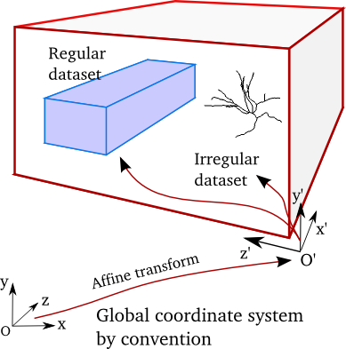

The Region
----------

We represent the unifying concept of a 3D spatial reference frame in NeuroHDF as a *Region*. A Region is the container
for spatio-temporal datasets and is mapped to a HDF Group node with Region-based metadata.

By convention, we define:

* *x*: first spatial direction
* *y*: second spatial direction
* *z*: third spatial direction

Each *Region* is spatially embedded with an affine transformation from its parent coordinate system to its coordinate system.
Because the root *Region* in the hierarchy has no parent *Region*, the parent coordinate system is defined by convention
as a Left-Hand-Coordinate system, where the first spatial direction is to the right (*x*), the second spatial direction
is upwards (*y*) and the third spatial direction is forward (*z*).

This means that the root *Region* node in the NeuroHDF hierarchy contains an affine transformation that might
reorder the convention root coordinate system.

Example: From NeuroHDF root-convention coordinate system "Right-Anterior-Superior" (RAS) coordinate systems.
In RAS coordinate systems, the meaning of the first spatial direction is "positive values go to the right",
second spatial direction is "positive values go forward", and third spatial direction is "positive values go upward".
"Superior" can also mean "Dorsal", for instance in humans when you look to the sky, but this must not be the case.
Thus, its is necessary the detach the meaning or interpretation of the three, ordered spatial axes, and define
what it means to move in positive or in negative direction of e.g. the first spatial direction etc. For instance,
moving to the right for positive values, moving to the left for negative values, such as in the RAS coordinate system
or in the root-convention coordinate system. We encode this fact as a 3-tuple (an ordered list with three elements) of 2-tuples
containing string elements. The first element of the 2-tuple denotes the positive direction, the second the negative.
For instance, in the RAS coordinate system, we encode the meaning of the spatial direction (axes)
as: ( ("Right","Left"), ("Anterior","Posterior"), ("Superior", "Inferior") )
This gives us a good understanding of what the direction within a given *Region* mean. Note that this semantics
applies to the coordinate axes AFTER the affine transformation from its parent coordinate system.
Similarly, for the root-convention coordinate system, the meaning of the axes are:
( ("Right","Left"), ("Upwards","Downwards"), ("Forwards", "Backwards") )

We use the `OBO Spatial Ontology <http://obofoundry.org/cgi-bin/detail.cgi?id=spatial>`_ as identifiers.

The affine transformation not only specifies the orientation of the axes, but also the location of origo. This corresponds
to the translation (the translational part of the affine) of origo from the root-convention coordinate system to the *Region* origo.
Similarly, we want to denote the meaning of origo in the *Region* coordinate system. Often, particular neuroanatomical
landmarks are used to define the origo. They should optimally be very stable across individuals. For instance, in the Waxholm space,
origo is defined at "Bregma" which is the anatomical point on the skull at which the coronal suture is intersected perpendicularly
by the sagittal suture. (REF: http://en.wikipedia.org/wiki/Bregma)

Also find ontology term.

Furthermore, the metric unit for unity of each spatial direction is defined as a 3-tuple. For instance: ("mm", "mm", "mm")
The axes units are important to know the unit for the axis-aligned bounding box values. Later, each dataset defines
its own units for its object's spatial locations.

We use the `OBO Units of measurements Ontology <http://www.obofoundry.org/cgi-bin/detail.cgi?id=unit>`_ where "mm" is "UO:0000016" for instance.

TODO: How does this relate to the the scaling within the affine?

An optional metadata field specifies an axis-aligned bounding box by two points, where the axes are aligned to the
axes of the *Region* coordinate system. This basically defines the maximal spatial extent of the *Region*, but it
is not guaranteed to be correct. As we will see, *Regions* can contain other Regions, but also datasets. These
datasets can change over time, thus changing in its spatial configuration over time. The bounding-box would then
either denote the maximum bounding box at the first time frame, or alternatively be the maximum bounding box
across all time frames.

NeuroHDF node::

    Group["My Region Name"]
    .attrs["type"] = "Region"
    .attrs["affine"] -> 4x4 affine transformation as array
    .attrs["origo_semantics"] = {
        "name" : "anterior commisure",
        "OBO" : "UMLSCUI:C0152335"
    }
    .attrs["axes_semantics"] = {
        0 : { "positive" : {"name" : "right", "OBO" : "BSPO:0000007"},
              "negative" : {"name" : "left", "OBO : "BSPO:0000000"}
            },
        1 : { "positive" : {"name" : "anterior", "OBO" : "BSPO:0000055"},
              "negative" : {"name" : "posterior", "OBO : "BSPO:0000025"}
            },
        2 : { "positive" : {"name" : "dorsal", "OBO" : "BSPO:0000063"},
              "negative" : {"name" : "ventral", "OBO : "BSPO:0000068"}
            }
    }
    .attrs["axes_units"] = {
        0 : {"name" : "x", "unit" : {"name": "mm", "OBO" : "UO:0000016"} },
        1 : {"name" : "y", "unit" : {"name": "mm", "OBO" : "UO:0000016"} },
        2 : {"name" : "z", "unit" : {"name": "mm", "OBO" : "UO:0000016"} },
    }
    .attrs["AABB"] = np.array( [ [-10,-10,-10], [10,10,10] ], dtype = np.float32 )

    # now, the datasets ...

        Group["Regular data block"] ...
        ...
        Group["3D Skeletons"] ...

A *Region* contains spatio-temporal datasets that are spatially transformed relative
to the local coordinate system defined by the *Region*. The datasets are either
Regular or Irregular:

Each dataset specifies an affine transformation from its embedding *Region*. The affine for Irregular
datasets is the identity when the dataset's spatial location of the vertices are already relative
to the *Region* coordinate system. For regular datasets, the homogenous array can contain an arbitrary
number of dimensions, but it requires to have at least one spatial dimension to meaningfully be a child
of a *Region*. For the affine of a Regular dataset, only the spatial dimension of the array are relevant
for the embedding within the *Region*.

See the next section `Cookbook - Spatio-Temporal datasets`_ for details on the dataset representation.